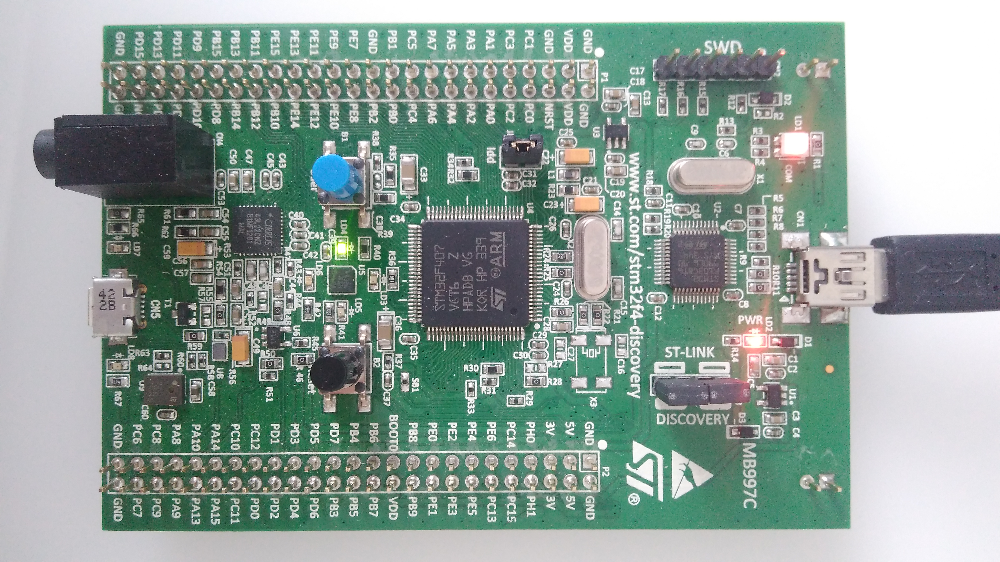

# Project description

A simple Exterian Interrupt (EXTI) template project for STM32F407VGT6 prepared using CMSIS
(without CUBE, HAL).

  
   A STM32F4Discovery board with green LED flashed after pushing User button

## How to use

* Clone or fork this repo
* Compile it with favorite IDE (SW4STM in my case)
* Flash the microcontroller

## How it works

In `main` function the hardware is initialized (LED and user button). The interrupt is triggered
by falling edge in user button pin. In interrupt function the LED state is toggled.

## License
The contents of this repository are covered under the [MIT License](./LICENSE.txt)

